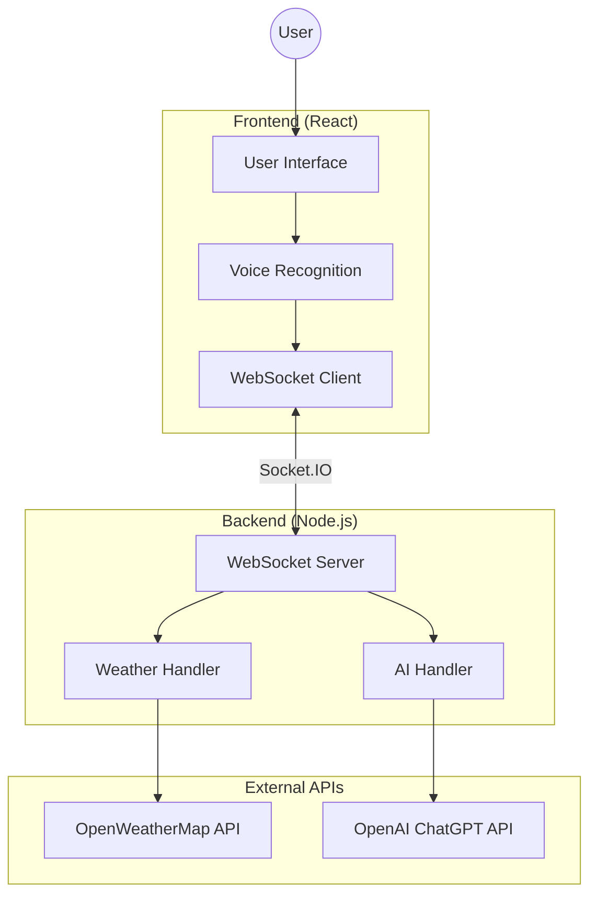
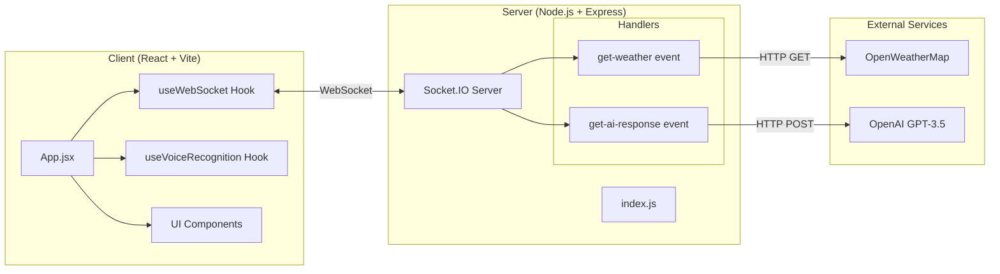

# TravelBuddy - トラベルバディ

A Japanese Voice Travel Assistant chatbot built with React, Node.js, and WebSocket for real-time communication.

## Tech Stack

| Layer | Technology |
|-------|------------|
| **Frontend** | React + Vite |
| **Backend** | Node.js + Express |
| **Real-time** | Socket.IO (WebSocket) |
| **Voice** | Web Speech API (Japanese) |
| **Weather** | OpenWeatherMap API |
| **AI** | OpenAI ChatGPT |

---

## High-Level Design (HLD)



### Data Flow
1. User speaks in Japanese via browser microphone
2. Web Speech API converts speech to text
3. Frontend sends text + location to backend via WebSocket
4. Backend fetches weather from OpenWeatherMap
5. Backend sends weather + user text to OpenAI for suggestions
6. AI response sent back to frontend via WebSocket
7. Response displayed in chat interface

---

## Low-Level Design (LLD)



### Component Details

| Component | File | Responsibility |
|-----------|------|----------------|
| App | `App.jsx` | Main UI, state management |
| useWebSocket | `hooks/useWebSocket.js` | Socket.IO connection |
| useVoiceRecognition | `hooks/useVoiceRecognition.js` | Speech-to-text |
| Server | `server/index.js` | Express + Socket.IO |

### WebSocket Events

| Event | Direction | Payload |
|-------|-----------|---------|
| `get-weather` | Client → Server | `{latitude, longitude}` |
| `weather-response` | Server → Client | `{success, data}` |
| `get-ai-response` | Client → Server | `{voiceText, weather}` |
| `ai-response` | Server → Client | `{success, data}` |

---

## Project Structure

```
├── server/                 # Node.js backend
│   ├── index.js           # WebSocket server
│   ├── package.json       # Dependencies
│   └── .env.example       # Template for API keys
│
├── client/                 # React frontend
│   ├── src/
│   │   ├── App.jsx        # Main component
│   │   ├── hooks/         # Custom hooks
│   │   └── components/    # UI components
│   └── public/
│       └── logo.png       # App logo
│
└── README.md
```

## Quick Start

### 1. Configure API Keys

```bash
cd server
cp .env.example .env
# Edit .env and add your API keys
```

### 2. Start Backend Server

```bash
cd server
npm install
npm start
# Server runs on http://localhost:3001
```

### 3. Start Frontend (New Terminal)

```bash
cd client
npm install
npm run dev
# App runs on http://localhost:5173
```

### 4. Open in Chrome

Open http://localhost:5173 and allow microphone access.

## Features

- Japanese Voice Recognition (Web Speech API)
- Real-time WebSocket Communication
- Location-based Weather Data
- AI-powered Travel Suggestions
- Professional Split-layout UI

## API Keys Required

- **OpenWeatherMap**: https://openweathermap.org/api
- **OpenAI**: https://platform.openai.com/api-keys

---

Developed by Abhishek Kumar
